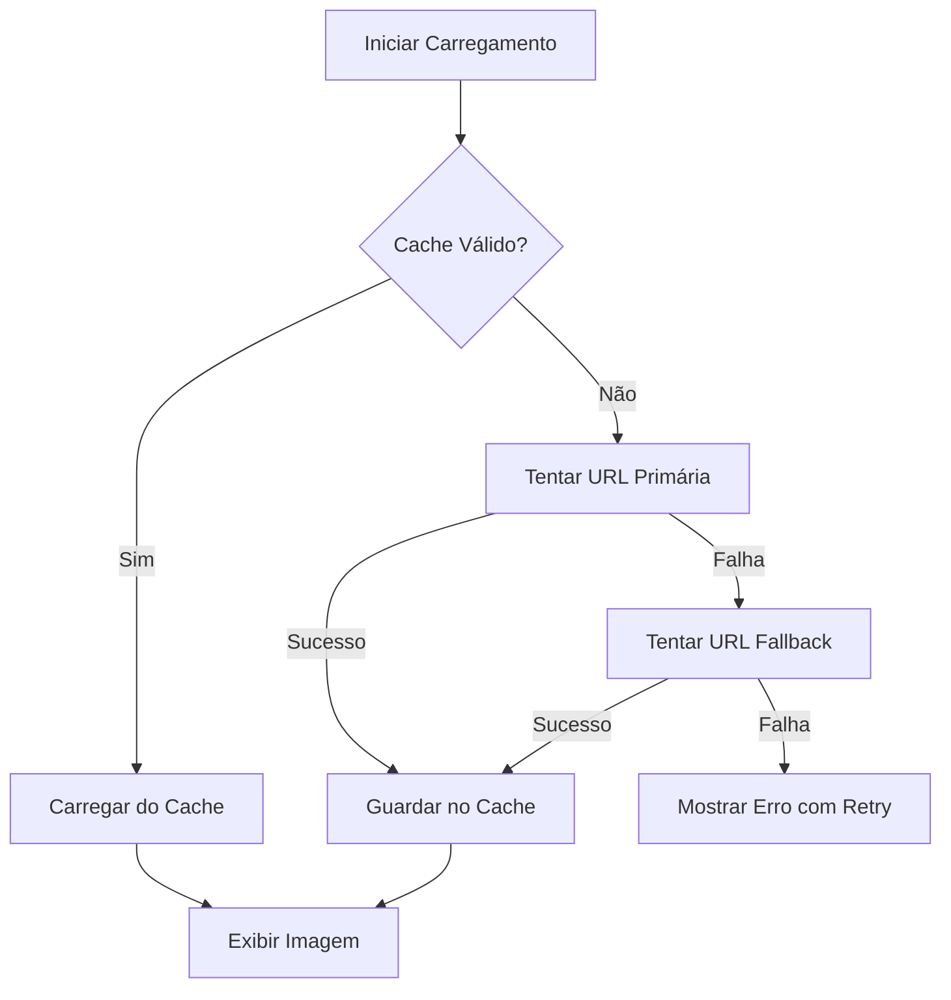

# Sistema de Cache para Estatísticas GitHub

## 🎯 Objetivo

Implementar um sistema de cache robusto que guarda as imagens das estatísticas GitHub quando carregam com sucesso, permitindo que o portfolio continue a exibir estatísticas mesmo quando os serviços externos estão indisponíveis.

## ✨ Funcionalidades Implementadas

### 1. **Cache Automático de Imagens**
- Quando uma imagem de estatística carrega com sucesso, é automaticamente guardada no `localStorage`
- Cache válido por 24 horas
- Não requer intervenção do utilizador

### 2. **Carregamento Inteligente**
```javascript
// Ordem de tentativa:
1. Verificar cache local (se válido)
2. Tentar carregar da URL primária
3. Tentar carregar da URL fallback
4. Mostrar mensagem de erro com retry
```

### 3. **Gestão Automática de Cache**
- Cache expira após 24 horas
- Limpeza automática de cache expirado
- Função para limpar todo o cache manualmente

## 🔧 Implementação Técnica

### Estrutura do Cache

```javascript
// Chave no localStorage
'github-stats-cache-{statsType}'

// Dados guardados
{
    url: 'https://...',  // URL da imagem
    timestamp: 1234567890  // Timestamp do cache
}
```

### Tipos de Estatísticas Cacheadas

1. **github-stats** - Estatísticas gerais do GitHub
2. **top-langs** - Linguagens mais usadas
3. **profile-summary** - Resumo detalhado do perfil
4. **streak-stats** - Sequência de contribuições
5. **activity-graph** - Gráfico de atividade

### Funções Principais

#### `cacheImage(statsType, imageUrl)`
Guarda a URL da imagem no localStorage com timestamp.

#### `getCachedImage(statsType)`
Recupera a URL da imagem do cache se ainda for válida (< 24h).

#### `clearCache()`
Remove todas as imagens cacheadas do localStorage.

## 📊 Fluxo de Carregamento



## 🎨 Experiência do Utilizador

### Primeira Visita
1. Imagens carregam dos serviços externos
2. Imagens bem-sucedidas são cacheadas automaticamente
3. Utilizador vê estatísticas normalmente

### Visitas Subsequentes (< 24h)
1. Imagens carregam instantaneamente do cache
2. Não há dependência de serviços externos
3. Experiência mais rápida e confiável

### Quando Serviços Estão Indisponíveis
1. Se cache existe: Mostra imagens cacheadas
2. Se cache não existe: Mostra mensagem de erro com retry
3. Utilizador pode tentar novamente quando quiser

## 💡 Vantagens

### Performance
- ✅ Carregamento instantâneo de imagens cacheadas
- ✅ Redução de requisições a serviços externos
- ✅ Melhor experiência em conexões lentas

### Confiabilidade
- ✅ Funciona offline (se cache existe)
- ✅ Resiliente a falhas de serviços externos
- ✅ Degradação graciosa quando serviços falham

### Experiência do Utilizador
- ✅ Estatísticas sempre visíveis (quando cacheadas)
- ✅ Sem dependência total de serviços externos
- ✅ Mensagens claras quando cache não existe

## 🔍 Verificação

### Como Testar o Cache

1. **Primeira Visita**:
   ```
   - Abrir DevTools (F12)
   - Ir para Application > Local Storage
   - Verificar chaves 'github-stats-cache-*'
   ```

2. **Testar Offline**:
   ```
   - Carregar o site normalmente
   - Abrir DevTools > Network
   - Selecionar "Offline"
   - Recarregar página (F5)
   - Estatísticas devem aparecer do cache
   ```

3. **Verificar Expiração**:
   ```javascript
   // No console do browser
   const cache = localStorage.getItem('github-stats-cache-github-stats');
   const data = JSON.parse(cache);
   const age = Date.now() - data.timestamp;
   console.log(`Cache age: ${age / 1000 / 60 / 60} hours`);
   ```

### Limpar Cache Manualmente

```javascript
// No console do browser
window.githubStatsHandler.clearCache();
```

## 📝 Configuração

### Tempo de Expiração do Cache

Atualmente configurado para 24 horas. Para alterar:

```javascript
// Em github-stats.js, linha ~3
this.cacheTimeout = 86400000; // 24 horas em milissegundos

// Exemplos:
// 1 hora:  3600000
// 12 horas: 43200000
// 48 horas: 172800000
```

## 🚀 Melhorias Futuras (Opcionais)

### Possíveis Extensões

1. **Cache de Projetos GitHub**
   - Cachear também os dados dos repositórios
   - Reduzir chamadas à API do GitHub

2. **Service Worker**
   - Implementar Service Worker para cache mais robusto
   - Suporte offline completo

3. **Atualização em Background**
   - Atualizar cache em background quando expirar
   - Manter sempre dados frescos

4. **Compressão de Imagens**
   - Comprimir imagens antes de cachear
   - Reduzir uso de localStorage

## 📊 Impacto

### Antes
- ❌ Dependência total de serviços externos
- ❌ Falhas frequentes quando serviços indisponíveis
- ❌ Experiência inconsistente

### Depois
- ✅ Cache local de 24 horas
- ✅ Estatísticas visíveis mesmo offline
- ✅ Experiência consistente e profissional
- ✅ Carregamento mais rápido

## 🔗 Arquivos Modificados

1. **src/js/github-stats.js**
   - Adicionadas funções de cache
   - Modificado fluxo de carregamento
   - Implementada lógica de fallback

2. **src/js/github-api.js**
   - Atualizada descrição do projeto IOT
   - Texto mais profissional e detalhado

## ✅ Testes

Todos os 59 testes continuam a passar:
- ✅ Validação HTML
- ✅ Validação CSS
- ✅ Validação JavaScript
- ✅ Design Responsivo
- ✅ Acessibilidade
- ✅ Performance

---

**Implementado**: 13 de Janeiro de 2026  
**Status**: ✅ Funcional e testado  
**Commit**: 3987c38